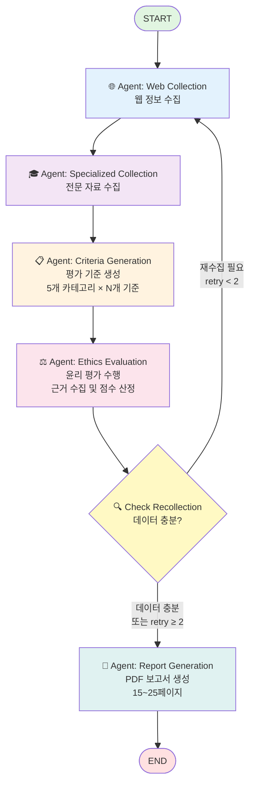

# 🧭 AI Ethics Agent

> **AI 서비스의 윤리적 리스크를 자동 진단**하고, **EU AI Act (2024)** 및 **ALTAI** 기준에 따라 **근거 기반(grounded) 개선 권고안**을 생성하는 에이전트

[](#)

---

## ✨ Overview

**AI Ethics Agent**는 AI 법제 문서(EU AI Act, ALTAI 등)와 서비스 기술 문서를 **결합 분석**하여,
- 핵심 **윤리/규제 리스크 식별**
- 조항/근거 **출처가 명시된 개선 권고안 자동 생성**
- **우선순위/난이도/영향도** 기반의 구현 로드맵 제안

을 목표로 한다.

> EU는 **2024년 8월 AI Act를 발효**, **2025년 2월부터 단계적 규제를 시행**하고 있다. 이에 따라 기업의 **신뢰성·투명성·책임성** 입증 요구가 급증하고 있으나, 많은 조직이 **평가 기준과 필수 증적(문서) 체계**를 명확히 파악하지 못하고 있다. 본 프로젝트는 이 **정보 비대칭**을 해소하는 도구이다.

---

## 🧩 Key Features

- **1️⃣ Domain-Adaptive Evaluation Metrics**  
  도메인(예: 의료·제조·금융 등)에 따라 **고위험 기준과 평가지표 산술식이 다르게 반영**될 것으로 예상된다.<br>
  따라서 서비스 도메인을 기반으로, 임베딩된 RAG 문서에서 **가장 유사한 10개 조항을 정밀 검색**하고 보고서에는 **참고한 문서**가 명시된다.

- **2️⃣ AI Data ↔ Ethical Metric Auto-Mapping**  
  기업이 보유한 AI 서비스 데이터가 **어떤 윤리 지표와 일대일 대응되는지 불명확**한 문제를,  
  에이전트가 **간접 추론 기반 매핑**을 수행하여 서비스의 **윤리적 점수(ethical score)** 를 산출한다.

- **3️⃣ Self-Healing Evaluation Loop (LangGraph)**  
  평가 자료가 부족하거나 신뢰도가 낮을 경우 **LangGraph 기반 루프 구조**로 자동 재수집-재평가를 수행한다.<br>
  단, **무한 루프 방지를 위한 예외 제어 로직**이 내장되어 있다.

- **4️⃣ Experimental Validation & Generalization**  
  실험적으로 **의료 도메인 사례(Vara vs Babylon Health)** 를 비교하여 실제 윤리 준수도 평가의 효용성을 검증한다.<br>
  추가로 다른 도메인(생성형AI-OpenAI)에 적용해 **에이전트의 강건성·일반화 성능**을 검증한다.

---
## 🧰 Tech Stack

| Category   | Details                                  |
|-------------|------------------------------------------|
| **Framework** | LangGraph · LangChain · Python |
| **LLM** | GPT-4o-mini (OpenAI API) |
| **Retrieval** | ChromaDB |
| **Embedding Model** | BGE-M3 |

---

## 🤖 Agents

| Agent | File | Description |
|--------|------|-------------|
| **Web Collection Agent** | `web_collection.py` | Tavily API를 이용해 웹 전반의 기본 정보를 수집하고, 출처·날짜·신뢰도를 분류 |
| **Specialized Collection Agent** | `specialized_collection.py` | 학술 논문, 리포트, 공공 문서 등 **전문 자료**만 정밀 수집하는 특화 에이전트 |
| **Ethics Criteria Generator** | `ethics_criteria_generator.py` | 임베딩된 규제 문서(RAG 기반)를 참조해 **도메인별 평가지표 세트**를 생성 |
| **Ethics Evaluator Agent** | `ethics_evaluator.py` | 수집된 정보와 평가지표를 결합하여 **윤리적 리스크 점수**를 산출하고, 기준 조항을 명시 |
| **Report Generator** | `report_generator.py` | 평가 결과와 근거를 통합해 **Markdown/PDF 보고서**를 자동 생성 |

---

## 🧩 State Schema (요약 버전)

| Key | Description |
|------|-------------|
| **run_id** | 실행 고유 ID (UUID 기반) |
| **company_name / domain** | 평가 대상 기업명과 산업 도메인 |
| **current_stage** | 현재 파이프라인 단계 (init / collection / evaluation / report 등) |

### 1. 데이터 수집 단계
| Key | Description |
|------|-------------|
| **web_collection** | 일반 웹 문서 수집 (보도자료, 기업 웹사이트, 미디어 기사 등) |
| **specialized_collection** | 학술·규제·공공기관 등 전문 자료 수집 |
| **merged_documents** | 두 수집 결과를 통합한 문서 리스트 |
| **quality_score** | 수집 데이터의 다양성·신뢰성·최신성 평가 점수 |
| **is_data_sufficient** | 수집 데이터가 평가에 충분한지 여부 |

### 2. 분석 단계
| Key | Description |
|------|-------------|
| **analysis_result** | 기업의 기술, 서비스 구조, 주요 리스크 등의 분석 결과 |
| **analysis_score** | 분석 근거의 신뢰도, 교차검증 수준 등 점수화된 지표 |
| **is_analysis_sufficient** | 분석 정보가 충분한지 여부 |

### 3. 윤리 평가 단계
| Key | Description |
|------|-------------|
| **ethics_evaluation_criteria** | 도메인별 임베딩 문서 기반으로 생성된 평가지표 세트 |
| **ethics_evaluation** | 투명성, 데이터 거버넌스, 책임성 등 항목별 평가 결과 |
| **ethics_score** | 윤리 평가 총점 및 항목별 세부 점수 |
| **critical_issues** | 주요 윤리 리스크 및 개선 권고사항 목록 |

### 4. 보고서 생성 단계
| Key | Description |
|------|-------------|
| **final_scores** | 데이터 품질, 분석 신뢰도, 윤리 점수를 종합한 최종 점수 |
| **report_content** | 요약, 근거, 권고안 등을 포함한 보고서 내용 |
| **report_path** | 생성된 보고서 파일 경로 (Markdown / PDF) |

### 5. 시스템 관리 정보
| Key | Description |
|------|-------------|
| **source_summary** | 수집 및 평가에 사용된 문서 출처와 ID 추적 정보 |
| **warnings / errors / limitations** | 경고, 오류, 한계 사항 로그 |
| **execution_log** | 각 에이전트의 실행 이력 (단계, 처리 문서, 수행 시간 등) |

---

### 🧾 프로젝트 아키텍처

---
### 📂 Directory Structure
```bash
├── agents/ # 핵심 에이전트 모듈
│ ├── web_collection.py # 웹 전반의 정보 수집 에이전트
│ ├── specialized_collection.py # 학술/규제 중심 정보 수집 에이전트
│ ├── ethics_criteria_generator.py# 도메인 기반 평가지표 생성 에이전트
│ ├── ethics_evaluator.py # 윤리적 판단 및 점수 산출 에이전트
│ └── report_generator.py # 결과 종합 및 보고서 생성 에이전트
│
├── chroma/ # RAG용 임베딩 및 검색 인덱스
│ └── ethics/ # EU AI Act 및 ALTAI 관련 벡터 데이터
│
├── data/ # 법령 문서
│ └── EU.pdf
│
├── reports/ # 자동 생성된 리포트 결과
│ ├── ethics_report_Babylon_Health_medical_20251023.pdf
│ └── ethics_report_Vara_medical_20251023_vol1.pdf
│
├── notebooks/
│ ├── embedding.ipynb # 임베딩 및 RAG 검증 실험
│ └── check_output.ipynb # 리포트 출력 점검 노트북
│
├── ethics_pipeline_graph.py # 전체 LangGraph 파이프라인 구조 정의
├── state_schema.py # LangGraph State 정의 (신뢰성·출처 추적 포함)
├── README.md # 프로젝트 개요 및 실행 가이드
└── requirements.txt # 의존 패키지 목록
```
---

## 💡 주요 결과 및 인사이트
1️⃣ 비교 평가 결과
| 기업 | 도메인 | 점수 | 등급 |특징 |
|------|------|------|------|------|
| **VARA** | medical | 60점 | C | 윤리 리스크 관리 프레임워크 보유, 투명성 보고서 공개 |
| **Babylon Health** | medical | 43점 | D | 윤리 정책 및 투명성 체계 미비 |
| **OpenAI** | generative-AI | 58점 | D | Safety 정책 존재, 투명성·데이터 거버넌스 논란 |

본 평가에서 **VARA**는 윤리 리스크 대응 측면에서 선도적인 기업임에도 불구하고 **60점(C등급)** 으로 산출되었고, **Babylon**은 **43점(D등급)으로**으로 평가되었다. 이는 절대 점수의 높고 낮음을 단순 비교하기보다, **에이전트가 두 기업 간의 윤리 대응 역량 차이를 명확히 구분해냈다는 점**에서 의미가 있다.<br><br>
추가로 범용 AI 기업인 **OpenAI**에 대한 평가를 수행한 결과 **58점(D등급)** 으로 측정되었으며,  **기업 특성을 반영한 중간 수준 내에서 평가가 이루어짐**을 확인하였다. 
이는 본 에이전트가 임베딩된 문서를 기반으로 **도메인별 특성을 반영한 평가 기준을 자동 생성**하면서도 **내부적으로 일관된 평가 로직을 유지함**을 의미한다.

2️⃣ 평가 한계
비록 본 평가는 **외부 공개 자료만을 활용한 간접 측정치** 기반으로 수행되어 평가지표의 **객관적 근거와 신뢰도**에는 일부 한계가 존재하지만,  
그럼에도 불구하고 모델이 **상대적 리스크 패턴을 합리적으로 분별할 수 있음을 보여준다.**  

3️⃣ 향후 활용 방향
향후 **기업 내부 데이터 연동**과 **EU AI Act 세부 지표 반영**이 이루어진다면,  
본 에이전트는 **윤리 리스크 사전 진단 및 개선 가이드 제공 도구**로서 실질적 활용 가치를 갖출 것으로 기대된다.<br>
이는 기업이 법적 규제 이전 단계에서 **`자체 윤리 점검 체계 (Ethics Readiness Check)`**를 수행할 수 있는 기반이 될 것이다.
